# Pandas

Pandas es una librería de Python creada específicamente para el análisis de datos. Tiene un elemento clave denominada **Dataframe**, que no es más que una serie de datos en una tabla donde podremos ver los registros en filas y columnas ordenados por un índice. Cada una de las columnas puede tener un tipo de dato diferente, por ejemplo datos de tipo entero, float, strings, objetos, etc.

## Importación de Pandas

Por convención la imporatción de la librería Pandas en nuestro código se realiza de la siguiente manera:

```python
import pandas as pd
```

A partir de este momento podremos utilizar el alias `pd` para invocar cualquier método de la librería Pandas. Por ejemplo, para importar un fichero CSV lo haríamos de la siguiente manera:

```python
df = pd.read_csv(
    r'file.csv',
    index_col=0,
    nrows=5,
    encoding='ISO-8859-1',
    delimiter=';'
)
```
En este ejemplo se han utilizado algunos parámteros del método `read-csv`, donde:
* `r'file.csv'` es el archivo CSV con el que se va a trabajar. La `r` del inicio indica que la cadena de texto que hay dentro de las comillas se va a tratar en crudo (raw). Este parámetro es obligatorio.
* `index_col` es el índice de la columna que queremos utilizar como índice. Es opcional y si no se utiliza el dataframe mostrará como índice los números del índice de cada registro.
* `nrows` es el número de registros que queremos leer del fichero. Es opcional.
* `encoding` es el tipo de codificación de los datos. Es opcional.
* `delimiter` es el delimitador de datos empleado en el CSV. Es opcional, pero si no se utiliza no delimitará los datos de cada columna.

Para ver un ejemplo real usaremos el dataset llamado `Info_pais.csv` de la carpeta `datasets` con los siguiente atributos:

```python
df = pd.read_csv(
    r'../datasets/Info_pais.csv',
    encoding='ISO-8859-1',
    delimiter=';'
)
```

Una vez definido el dataframe y almacenado en la variable `df`, si no estamos haciendo uso del atributo `nrows`, podremos mostrar una cabecera con los 5 primeros elementos utlizando el método `head()` de la siguiente manera:

```python
df.head()
```

<p align="center">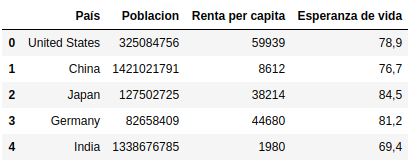</p>
<br>

A este método `head()` se le puede indicar dentro de los paréntesis el número de registros que se quieren mostrar, por ejemplo para mostrar solo los 20 primeros registros se haría se la siguiente manera:

```python
df.head(20)
```

<p align="center">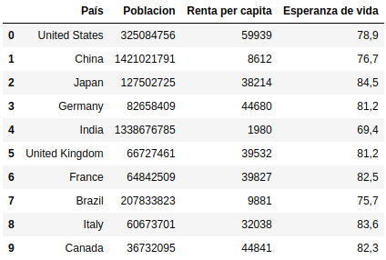</p>
<br>

## Ordenación de los datos

Ahora que ya tenemos importada la librería `pandas` e instanciado un dataframe `df` podremos tratar o manipular la información de diferentes maneras. En este caso vamos a ordenar los datos en base a una columna, por ejemplo la columna `Esperanza de vida`, y lo haremos en orden ascendente de la siguiente manera:

```python
df_order = df.sort_values(
    'Esperanza de vida',
    ascending=True
)
```

El atributo `ascending` es opcional, si no se utiliza siempre es ascendente, pero conviene ponerlo con valor `True` o `False`, según nos interese.

Si ahora mostramos la cabecera con los 5 primeros registros veremos que están ordenados de menor a mayor según los datos de la columna `Esperanza de vida`:

<p align="center">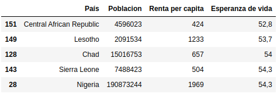</p>
<br>

## Visualización con Matplotlib

Matplotlib es una librería de visualización que tiene una gran veriedad de gráficos y que es fácilmente configurable. Más información acerca de los gráficos disponibles en https://matplotlib.org/gallery/index.html. Matplotlib viene con la instalación de Anaconda. Para utilizar esta librería debemos importarla de la siguiente manera:

```python
import matplotlib.pyplot as plt
```

A partir de este momento podremos utilizar en nuestro código el alias `plt` para acceder a todos los métodos de esta librería. Veamos un ejemplo en el que cargaremos un array de datos para el eje `x`, llamado por ejemplo `year`, y otro array de datos para el eje `y`, llamado por ejemplo `value`:

```python
year = [2020, 2021, 2022]
value = [5, 6, 9]
```

Finalmente podremos generar un gráfico de líneas mediante el método `plot()` de la librería `matplotlib`, al que le tendremos que pasar como argumentos primero el array de datos que queremos utilizar en el eje `x` y segundo el array que usaremos para el eje `y`:

```python
plt.plot(year, value)
```

<p align="center">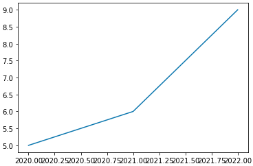</p>
<br>

Si quisieramos generar otro tipo de gráfico con los mismos datos podríamos utilizar por ejemplo el método `scatter()` al que también hay que pasarle como argumentos los datos de los ejes `x` e `y`:

```python
plt.scatter(year, value)
```

<p align="center">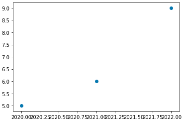</p>
<br>

Esta sería una manera de crear gráficos muy sencillos a partir de un par de listas con datos, pero normalmente se suelen utilizar fuentes de datos más grandes y complejas como son los dataframes que hemos visto anteriormente. Para visualizar con la librería `matplotlib` la infomación de un dataframe podemos hacerlo de la siguiente manera. Primero importamos el dataframe, en este caso uno llamado `hum_temp.csv` con algunos datos random relativos a humedad y temperatura:

```python
import pandas as pd
df = pd.read_csv(
    r'../datasets/hum_temp.csv',
    encoding='ISO-8859-1',
    delimiter=';'
)
```

Comprobamos que se ha cargado correctamente:

```python
df
```

<p align="center">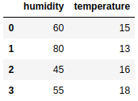</p>
<br>

A continuación usamos el método `plot()` de la instancia `plt` al que le pasariamos el nombre del dataframe, en este caso `df` y entre corchetes el nombre de la columna que queremos utilizar para representarlo en el eje `y`, si no se especifica el eje `x` en este se utilizarán los valores del índice de los registros de datos:

```python
plt.plot(df['temperature'])
```

<p align="center">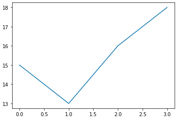</p>
<br>

Como se puede ver, los datos de la columna `temperature` aparecen en el eje `y` y el índice de los datos en el eje `x`.

Veamos una manera mejor de representar los datos de este dataframe, en este caso usaremos el método `plot()` con el dataframe `df` de la siguiente manera:

```python
df['humidity'].plot()
```

<p align="center">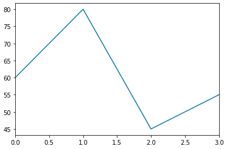</p>
<br>

Si eliminamos el nombre de la columna entre corchetes y especificamos únicamente el nombre del dataframe `df` podremos ver en el mísmo gráfico todos los registros de cada columna en líneas diferentes, cada una con un color distinto.

```python
df.plot()
```

<p align="center">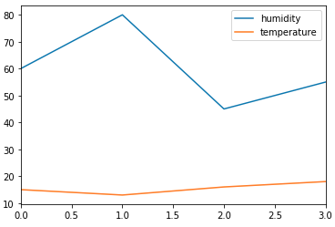</p>
<br>

### Ejemplo Standard & Poor's 500

Veamos otro ejemplo en el que vamos a trabajar con otro dataset. En este caso vamos a ver la evolución de la cotización de un índice bursatil como el Standard & Poor's 500.

Primero creamos un dataframe llamado `df_sp500` en el que importaremos el archivo CSV `SP500_data.csv` de la siguiente manera:
```python
df_sp500 = pd.read_csv(
    r'../datasets/SP500_data.csv',
    encoding='ISO-8859-1',
    delimiter=','
)
```

Si imprimimos la cabecera podremos visualizar los 5 primeros registros:

```python
df_sp500.head()
```

<p align="center">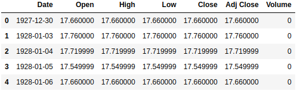</p>
<br>

Para visualizar este dataframe primero importaremos la librería `matplotlib` de la siguiente manera:

```python
import matplotlib.pyplot as plt
```

Ahora vamos a representar la columna del cierre bursatil de cada día, columna `Close`:

```python
df_sp500['Close'].plot()
```

<p align="center">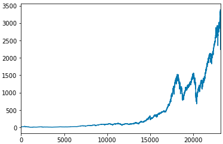</p>
<br>

En este gráfico podremos ver la evolución del índice bursatil, pero si nos fijamos en el eje `x` ha representado el índice de cada registro. Para poder representar en el eje `x` la fecha del dato debemos especificar que el índice del datframe `df_sp500` ha de ser la columna `Date`, de la siguiente forma:

```python
df_sp500.index = df_sp500['Date']
```

Si volvemos a mostrar la cabecera veremos que ahora se han insertado en el índice los valores del campo Date:

```python
df_sp500.head()
```

<p align="center">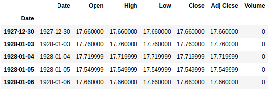</p>
<br>

volvemos a representar el gráfico de nuevo con la intrucción de antes:

```python
df_sp500['Close'].plot()
```

<p align="center">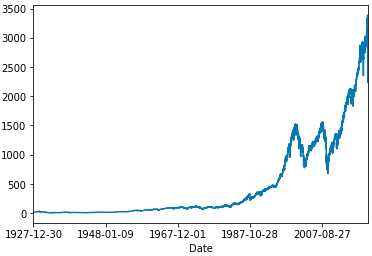</p>
<br>

Ahora vemos que en el eje `x` se representan los valores del campo o columna `Date`.

### Ejemplo COVID-19 en España por comunidades autónomas

En este otro ejemplo vamos a trabajar con un dataset que he obtenido de [este site](https://datos.gob.es/en/catalogo/e05070101-evolucion-de-enfermedad-por-el-coronavirus-covid-19). Se tratan de los casos detectados de COVID-19 por comunidades autónomas en España.

Primero creamos un dataframe llamado `df_covid19_ccaas` en el que importaremos el archivo CSV `datos_ccaas.csv` de la siguiente manera:
```python
df_covid19_ccaas = pd.read_csv(
    r'../datasets/datos_ccaas.csv',
    encoding='ISO-8859-1',
    delimiter=','
)
```

Si imprimimos la cabecera podremos visualizar los 5 primeros registros:

```python
df_covid19_ccaas.head()
```

<p align="center">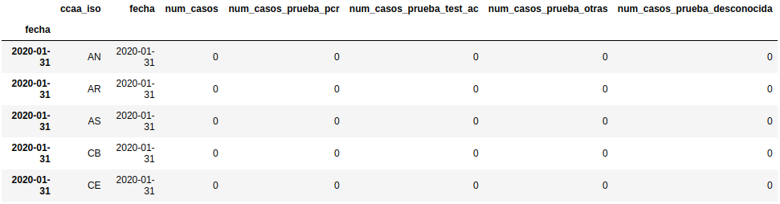</p>
<br>

Como siempre, importamos la librería `matplotlib` si no lo tuviéramos importada de ejecuciones anteriores.

```python
import matplotlib.pyplot as plt
```

Estableceremos tal y como hemos visto en el ejemplo anterior el campo `fecha` como índice y los datos de la columna `num_casos` en el eje `y` de la siguiente manera:

```python
df_covid19_ccaas.index = df_covid19_ccaas['fecha']
df_covid19_ccaas['num_casos'].plot()
```

<p align="center">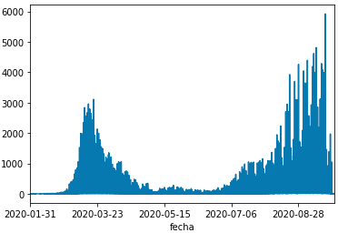</p>
<br>

## Ejemplo esperanza de vida frente a renta per capita por países

En este ejemplo vamos a utilizar el caso de uso que vimos anteriormente en el que teníamos la esperanza de vida frente a la renta per capita por países. Vamos a ver si existe una correlación entre estas dos variables.

```python
df = pd.read_csv(
    r'../datasets/Info_pais.csv',
    encoding='ISO-8859-1',
    delimiter=';'
)
```

Ahora pondremos los datos en orden ascendente según los valores de la columna `Esperanza de vida` de la siguiente manera:

```python
df_order = df.sort_values(
    'Esperanza de vida',
    ascending=True
)

df_order.head()
```

<p align="center"></p>
<br>

Es el momento de crear el gráfico mediante el método `scatter()`. Representaremos en el eje `x` los datos de la columna `Renta per capita` y en el eje `y` los datos de la columna `Esperanza de vida`.

```python
plt.scatter(df_order['Renta per capita'], df_order['Esperanza de vida'])
```

<p align="center">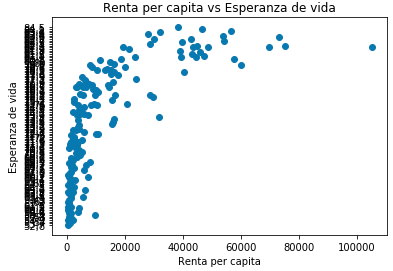</p>
<br>

De momento se aprecia un gráfico que nos da una idea aproximada de cómo se ven los datos. Podemos añadir un título y etiquetas a los ejes `x` e `y` del gráfico de la siguiente manera:

```python
plt.scatter(
    df_order['Renta per capita'],
    df_order['Esperanza de vida']
)
plt.title('Renta per capita vs Esperanza de vida')
plt.xlabel('Renta per capita')
plt.ylabel('Esperanza de vida')
```

En el gráfico que acabamos de generar los puntos  aparecen uniformes. Vamos a configurar el gráfico para que sean proporcionales tanto en tamaño como en color para cada país. Para ello debemos crear una nueva columna llamda por ejemplo `df_order['Poblacion_normalizada']` que normalice frente al máximo de población, por lo que le asignaremos como valores el valor de la columna `Población` dividido entre el valor máximo de esta columna `Población`, de este modo lo estaríamos escalando o normalizando.

```python
df_order['Poblacion_normalizada'] = df_order['Poblacion']/max(df_order['Poblacion'])
```

De este modo, el país que tenga la población más alta quedaría escalado a `1` y el resto de países quedarían normalizado en base a este valor máximo.

Existen grandes diferencias en número de habitantes entre unos países y otros, por ejemplo China con 1200 millones y otros que podrían tener 50000. Para evitar que un país con esta gran cantidad de habitantes inunde el gráfico es recomendable que en vez de dividir la población de cada país entre el máximo de población, hacer la división del máximo entre `10000`, para no tener un factor tan elevado.

```python
df_order['Poblacion_normalizada'] = df_order['Poblacion']/(max(df_order['Poblacion'])/10000)

df_order.head()
```

<p align="center">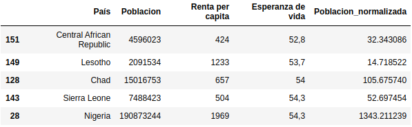</p>
<br>


Ahora podremos usar esta nueva columna con los datos escalados para crear una visualización de los datos mucho más potente.

Es el momento de generar un nueva visualización utilizando la nueva columna de datos normalizados que hemos generado, por ejemplo con el siguiente código:

```python
plt.scatter(
    df_order['Renta per capita'],
    df_order['Esperanza de vida'],
    s=df_order['Poblacion_normalizada']
)
plt.title('Renta per capita vs Esperanza de vida')
plt.xlabel('Renta per capita')
plt.ylabel('Esperanza de vida')
```

Para modificar el tamaño hemos utilizado el parámetro `s` (size) y como valor usamos la columna `Poblacion_normalizada`.

<p align="center">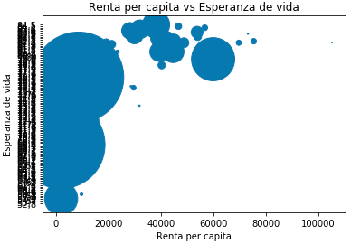</p>
<br>

El problema que vemos es que la visualización es muy pequeña, pero podemos mejorar esto añadiendo a nuestro código lo siguiente para aumentar las pulgadas de nuestro gráfico:

```python
plt.scatter(
    df_order['Renta per capita'],
    df_order['Esperanza de vida'],
    s=df_order['Poblacion_normalizada']
)
plt.title('Renta per capita vs Esperanza de vida')
plt.xlabel('Renta per capita')
plt.ylabel('Esperanza de vida')

fig = plt.gcf()
fig.set_size_inches(14.5, 10)
```

<p align="center">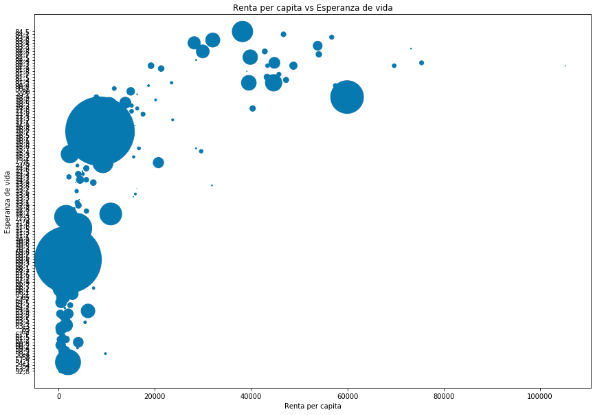</p>
<br>

De este modo se ve mucho más grande. Si fuera necesario se pueden cambiar los valores de la función `set_size_inches()` por otros más adecuados para ajustar el tamaño.

Si nos fijamos bien, ahora se representa cada burbuja de cada país de un tamaño diferente, dependiendo del valor que tenga en la nueva columna que hemos generado con los datos normalizados.

Ahora vamos a modificar el color. Para ello debemos añadir el atributo `c` (color), a conutnuación del atributo `s` (size), y como valor vamos a usar de nuevo la columna `Poblacion_normalizada`. Quedaría del siguiente modo:

```python
plt.scatter(
    df_order['Renta per capita'],
    df_order['Esperanza de vida'],
    s=df_order['Poblacion_normalizada'],
    c=df_order['Poblacion_normalizada']
)
plt.title('Renta per capita vs Esperanza de vida')
plt.xlabel('Renta per capita')
plt.ylabel('Esperanza de vida')

fig = plt.gcf()
fig.set_size_inches(14.5, 10)
```

<p align="center">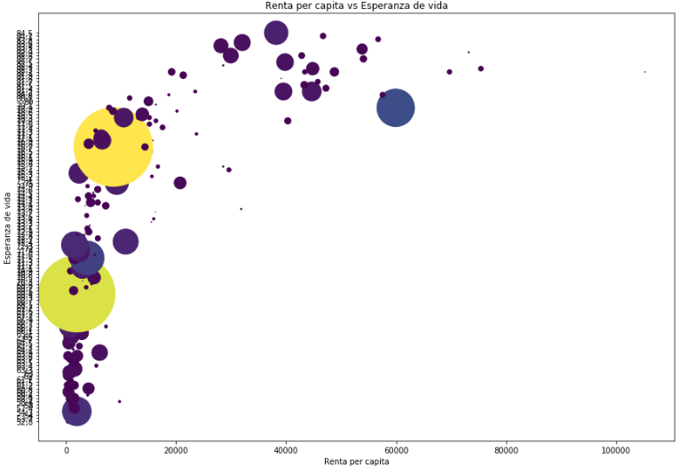</p>
<br>

En esta nueva visualización vemos que ya no solo se representa cada país en un tamaño diferente, sino que también en un color en función de la población.

También podremos añadir la etiqueta del nombre del país dentro de cada burbuja utilizando el método `annotate()`, por ejemplo añadiéndoselo solo a los `10` primeros países con el siguiente código:

```python
plt.scatter(
    df_order['Renta per capita'],
    df_order['Esperanza de vida'],
    s=df_order['Poblacion_normalizada'],
    c=df_order['Poblacion_normalizada']
)
plt.title('Renta per capita vs Esperanza de vida')
plt.xlabel('Renta per capita')
plt.ylabel('Esperanza de vida')

fig = plt.gcf()
fig.set_size_inches(14.5, 10)

for i in range(1, 10):
    plt.annotate(
        df_order['País'][i],
        (
            df_order['Renta per capita'][i],
            df_order['Esperanza de vida'][i]
        )
    )
```

<p align="center">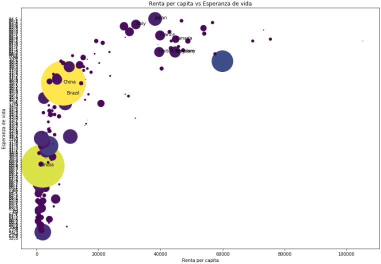</p>
<br>

Otro especto que podríamos mejorar es la representación de los datos del eje `y`, son los datos de `120` países y actualmente se ven muy juntos, se ve mal. esto se soluciona fácilmente con la fución `yticks()` a la que le pasaremos tres argumentos, que son un `1` representando el primer dato, `120` representamdo el último dato, y `10` para indicar que los queremos mostrar de diez en diez.

```python
plt.scatter(
    df_order['Renta per capita'],
    df_order['Esperanza de vida'],
    s=df_order['Poblacion_normalizada'],
    c=df_order['Poblacion_normalizada']
)
plt.title('Renta per capita vs Esperanza de vida')
plt.xlabel('Renta per capita')
plt.ylabel('Esperanza de vida')

fig = plt.gcf()
fig.set_size_inches(14.5, 10)

for i in range(1, 10):
    plt.annotate(
        df_order['País'][i],
        (
            df_order['Renta per capita'][i],
            df_order['Esperanza de vida'][i]
        )
    )


plt.yticks(ticks=range(1, 120, 10))
```

<p align="center">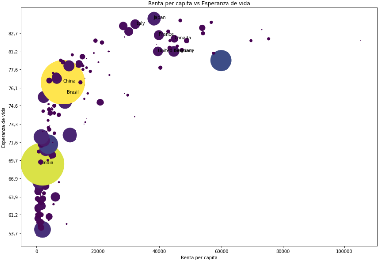</p>
<br>

De este modo hemos creado una visualizción de los datos muy potente y de una manera muy sencilla. La conclusión que podemos sacar de este gráfico es que efectivamente existe una correlación entre la renta per capita y la esperanza de vida según el país. Podemos ver que conforme la renta per capita aumenta la esperanza de vida también aumenta. También podemos deducir que el número de población no afecta a la esperanza de vida, ya que en la visualización que hemos creado se pueden ver países con una gran cantidas de población que no están entre los valores más bajos en cuanto a esperanza de vida se refiere.

# Conceptos estadísticos básicos

## Variables discretas y continuas

Se dice que una variable es *discreta* cuando no puede tomar ningún valor entre dos consecutivos, y que es *continua* cuando puede tomar cualquier valor dentro de un intervalo. Por ejemplo:

* Variable discreta:
```python
numero_alumnos_por_clase = [28, 31, 30, 27, 25, 36]
```
* Variable continua:
```python
temperatura_madrid = [28.3, 29.0, 22.47, 30.02, 17.6]
```

## Cálculo de la media y de la mediana

La *media* y la *mediana* son dos conceptos estadísticos básicos que debemos conocer. La media se calcula sumando todos los valores de un conjunto y dividiéndo el resultado entre el número total de valores.

<p align="center">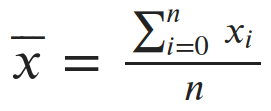</p>
<br>

Veamos un ejemplo, supongamos que tenemos la variable `v1` con la siguiente lista de valores:

```python
v1 = [4, 6, 3, 5, 8, 9, 2, 12, 16, 4, 7, 42, 13, 6, 7]
```

Para calcular la media primero debemos sumar todos los valores de la variable `v1` y dividirlo entre la cantidad de valores:

```python
sum(v1)/len(v1)
9.6
```

En este caso la media de los valores de la variable `v1` es `9.6`.

La mediana es el valor central de los valores de una variable, una vez estos están ordenados de manera ascendente. Veamos un ejemplo, utilizando los valores de la variable `v1` de antes, solo que con los elementos de la lista ordenados de forma ascendente y alamcenados en una nueva variable llamada `v2`:

```python
v2 = [2, 3, 4, 4, 5, 6, 6, 7, 7, 8, 9, 12, 13, 16, 42]
```

Para calcular la mediana podríamos hacer una función llamada `mediana` que reciba como argumento una lista de números, en nuestro caso le pasaremos la variable `v2`, por ejemplo:

```python
def mediana(lista):
    lst_sorted = sorted(lista)
    lst_len = len(lista)
    index = (lst_len - 1) // 2 # Floor division.

    if (lst_len % 2):
        return lst_sorted[index]
    else:
        return (lst_sorted[index] + lst_sorted[index + 1])/2.0

mediana(v2)
7.0
```

Como resultado obtenemos que la mediana de estos valores es `7`, que coincide con la posición central de los elementos de la variable `v2`. Si la variable tuviese un número par de elementos, la mediana sería la suma de los dos elementos centrales dividido entre dos.

En la siguiente representacin gráfica podemos ver la distribución de los valores del ejemplo anterior en los que la media (`9.6`) se representa como una línea azúl y la mediana (`7.0`) como línea verde.

<p align="center">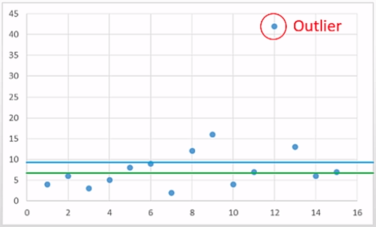</p>
<br>

Existe una diferencia entre la media y la media porque hay un valor que dista mucho del resto de valores de la secuencia, en nuestro caso es el `45`. A este tipo de datos se los denomina **outliers**. Si por el contrario todos los valores de la secuencia tuvieran un valor más o menos parecido podríamos ver que la media y la media tendrían también un valor similar.

Otro ejemplo con valores en los que encontramos un outlaier aún más elevado:

```python
v1 = [4, 6, 3, 5, 8, 9, 2, 12, 16, 4, 7, 282, 13, 6, 7]
v2 = [31, 23, 25, 20, 21, 29, 24, 26, 30, 27, 25, 24, 23, 32, 24]

def mediana(lista):
    lst_sorted = sorted(lista)
    lst_len = len(lista)
    index = (lst_len - 1) // 2 # Floor division.

    if (lst_len % 2):
        return lst_sorted[index]
    else:
        return (lst_sorted[index] + lst_sorted[index + 1])/2.0

mediana(v2)

print(f'La media de v1 es: {sum(v1)/len(v1)}')
print(f'La media de v2 es: {sum(v2)/len(v2)}')
print(f'La mediana de v1 es: {mediana(v1)}')
print(f'La mediana de v2 es: {mediana(v2)}')
```

Obtenemos el siguiente resultado:

```
La media de v1 es: 25.6
La media de v2 es: 25.6
La mediana de v1 es: 7
La mediana de v2 es: 25
```

Aquí vemos que la media en ambas variables `v1` y `v2` es `25.6`, sin embargo en las medianas existe una enorme diferencia, debido a que el resultado se ve más impactado por estos **outliers**, en este caso `282`, que dista mucho del resto de valores de la secuencia.

La media es un valor estadístico muy importante, pero habitualmente se utiliza la mediana ya que acaba siendo más representativo sobre la distrubición de nuestros datos, y evita todos estos posibles **outliers**.

## Varianza y desviación de una variable

La varianza de una variable nos indica la dispersión de un conjunto de datos respecto a su valor medio. Esto significa que si tenemos una varianza alta en nuestra variable, los valores de la variable van a estar más alejados del valor medio.

Matemáticamente la varianza de una variable se calcula de la siguiente manera:

1. A cada valor de la variable hay que restarle el promedio de la variable.
2. El resultado anterior se eleva al cuadrado.
3. Hay que hacer un sumatorio con el resultado de las operaciones anteriores para cada valor de la variable.
4. Se divide entre el número de valores de la variable.

<p align="center">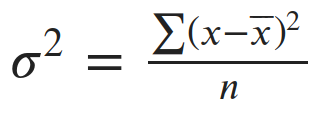</p>
<br>


La deviación estándar se puede calcular con la raíz cuadrada de la varianza:

<p align="center">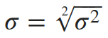</p>
<br>

Veamos un caso de uso. Tenemos un avariable `x` que tiene como valor el peso de los tomates que hemos recolectado durantre un periodo de 8 días.

* Tomate 1 = 60gr
* Tomate 2 = 56gr
* Tomate 3 = 61gr
* Tomate 4 = 68gr
* Tomate 5 = 51gr
* Tomate 6 = 53gr
* Tomate 7 = 69gr
* Tomate 8 = 54gr

```python
x = [60, 56, 61, 68, 51, 53, 69, 54]
```

Se suele utilizar más la varianza puesto que está menos influenciada por los valores positivos o negativos que pudiera haber en la diferencia entre el valor y el promedio, por lo tanto la varianza es más representativa a la hora de calcular la disperción de los datos de nuestro conjunto de datos.
